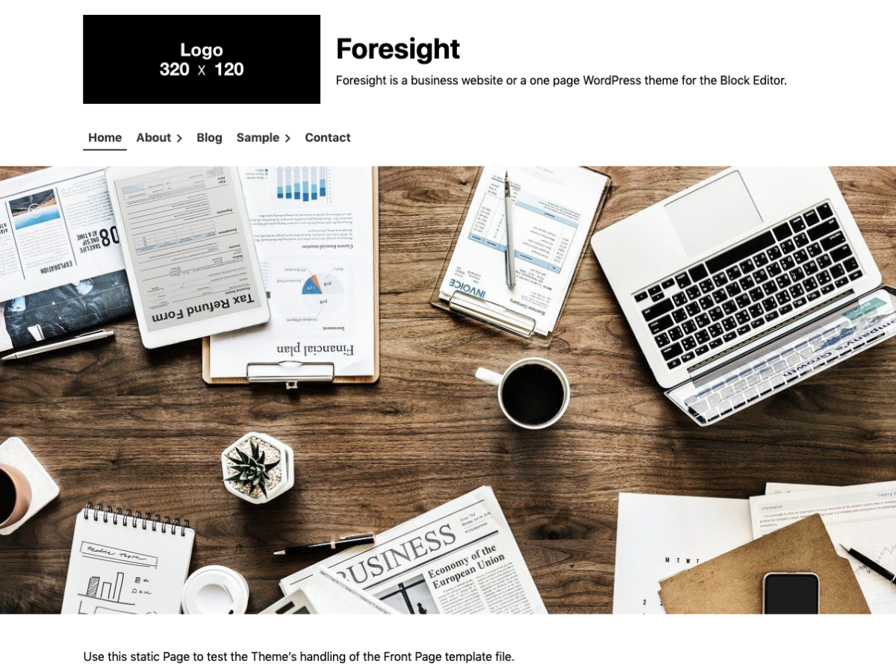

# Foresight WordPress Theme

Foresight is a business website WordPress theme for the Block Editor. It is also a one page WordPress theme that designed to take full advantage of the Block Editor.

This theme is well suited for business, landing page, branding or marketing. It provides a fast way to build website easily customizable for companies or freelancers. You can focus on content or webpage creation using the Block Editor.

WordPress Theme: [https://wordpress.org/themes/foresight/](https://wordpress.org/themes/foresight/)

Demo site: [https://cms.thingslabo.com/demo/foresight/](https://cms.thingslabo.com/demo/foresight/)

Documentation:

- [English](https://homepage.thingslabo.com/product/wp-theme-foresight/foresight-wordpress-theme-documentation/)
- [Japanese](https://homepage.thingslabo.com/product/wp-theme-foresight/wp-theme-foresight-manual-ja/)

Product page: [https://homepage.thingslabo.com/product/wp-theme-foresight/](https://homepage.thingslabo.com/product/wp-theme-foresight/)

## Features

* You can easily build a website with a customizer that select a layout and setting colors and fonts
* Full support the Block Editor so you can focus on creating content and web pages
* Mobile First, Responsive web design for any device - laptop, desktop, smartphone, iPad, etc
* Wide Width default page layout for the Block Editor
* Landing Page Template for landing page or one page
* Optimized for japanese fonts

## WordPress Theme Functions

* Enable the Block Editor
* Blog
* Select colors
	* Header text
	* Background
	* Header background
	* Footer background
	* Main color
	* Accent color
	* Sub color
* Custom logo
* Settings font family
	* Base
	* Site Title
	* Headings
* Settings fonts set
	* Web safe fonts
	* [Google Fonts](https://fonts.google.com/)
* Settings icon fonts
	* [Font Awesome Free](https://github.com/FortAwesome/Font-Awesome)
* Custom Header (Note: The Custom Header Image only shows in the page template `Top Page Template`.)
* Custom Background image
* Select archive layout
	* Article with featured image
	* Article Only
	* Article with Left-aligned featured image
	* Article with Right-aligned featured image
	* Card
	* Topics
* Enable sidebar layout (Two columns, Right sidebar layout)
* Settings archive excerpt
* Settings width ratio of footer widget column
	* 1:1
	* 2:1
	* 1:2
* Settings credit notation
* Custom menu
	* global menu
* Settings Widget
	* Page sidebar
	* Post sidebar
	* Footer
* Add template page
	* Top Page Template (page only)
	* Landing Page Template (page only)
	* Narrow Width Page Template (page only)
	* Sidebar Page Template (page and post)
	* Blank Page Template (page only)

## Requirements

* [WordPress](https://wordpress.org/) version 5.1 or later
* [PHP](https://www.php.net/) version 7.0 or later

## Browser Support

### Desktop

* Chrome: Current and (Current - 1)
* Edge: Current and (Current - 1)
* Firefox: Current and (Current - 1)
* Safari: Current and (Current - 1)
* Opera: Current

### Mobile

* Stock browser on Android 4.0+
* Safari on iOS 7+

### Unsupported Browsers

* Internet Explorer

## Frequently Asked Questions

### Where does the Custom Header Image appear?

The Custom Header Image only shows in the page template `Top Page Template`.
We recommend using Image Block and Cover Block instead of the Custom Header Image for other page templates Page and Posts.

### Where does the sidebar with the sidebar widget appear?

The widget area "Sidebar" is displayed on the Pages or Posts when the page template `Sidebar Page Template` is selected.
The sidebar is displayed on the archive page when "Add sidebar to Archive" is enabled in the "Archive" sub-panel in the "Layout" panel in the customizer.

## Resources

Foresight bundles the following third-party resources:

* Based on [WP Theme Boilerplate](https://github.com/thingsym/wp-theme-boilerplate), [GPLv2 or later](https://www.gnu.org/licenses/gpl-2.0.html)
* CSS reset by [normalize.css](https://necolas.github.io/normalize.css/), [MIT](https://opensource.org/licenses/MIT)
* [Font Awesome Free](https://github.com/FortAwesome/Font-Awesome), [MIT](https://opensource.org/licenses/MIT), [SIL OFL 1.1](https://opensource.org/licenses/OFL-1.1), [CC BY 4.0](https://creativecommons.org/licenses/by/4.0/deed)
* Header image for theme screenshot by [Kaique Rocha](https://stocksnap.io/photo/UTLSND0DES), [StockSnap's CC0 License](https://stocksnap.io/license)

## Contribution

### Patches and Bug Fixes

Small patches and bug reports can be submitted a issue tracker in GitHub. Forking on GitHub is another good way. You can send a pull request.

1. Fork [Foresight WordPress Theme](https://github.com/thingsym/foresight/) from GitHub repository
2. Create a feature branch: git checkout -b my-new-feature
3. Commit your changes: git commit -am 'Add some feature'
4. Push to the branch: git push origin my-new-feature
5. Create new Pull Request

## Changelog

### [1.2.0] - 2020.09.14

* add Custom Entry Meta to customizer
* imporve code with phpcs, phpmd and phpstan

### [1.1.4] - 2020.08.27

* fix scss
* update japanese translation
* update pot
* update testunit configuration
* fix composer.json
* fix webpack.config.js, generate compressed and uncompressed files
* fix npm scripts
* update package.json
* add customize option that show more reading link
* fix hook tags

### [1.1.3] - 2020.08.03

* fix Uncaught TypeError on landing-page

### [1.1.2] - 2020.07.27

* add Blank Page Template instead of Featured image Header Page Template
* remove Featured image Header Page Template
* change Theme URI
* fix iframe width in the wp-block
* trim white space below wp-block-image

### [1.1.1] - 2020.07.13

* fix Tags: is either empty or missing in style.css header
* add Tested up to in style.css header [Automated Theme Scanning: Fail]
* fix escaping
* fix phpcs.ruleset
* fix composer.json

### [1.1.0] - 2020.07.13

* remove wp-block-group padding
* fix iframe width in wrapper with embed blocks for alignfull
* add hooks to entry meta for custom post type
* fix archive layout for custom post type
* fix entry meta output for custom post type
* fix hooks priority
* fix wp-block-button hover
* add _editor-color-palette.scss
* assign object to variable for child theme
* update japanese translation
* update pot
* fix labels of archive layout
* fix wp-block-table style
* replace from eyecatch to featured image

### [1.0.9] - 2020.06.08

* replace array() to short array syntax []
* remove jQuery dependency, replace jQuery to pure javascript

### [1.0.8] - 2020.06.02

* update japanese translation
* update pot
* fix card layout
* integrate excerpt_mblength into excerpt_length

### [1.0.7] - 2020.05.19

* fix scss
* fix README

### [1.0.6] - 2020.05.18

* reformat with phpcs
* fix scss
* fix method name
* add note and FAQ about setting The Custom Header Image

### [1.0.5] - 2020.04.22 - for theme review

* bump up phpunit version 7.x
* fix version with wp_enqueue_style
* fix returns value in case is_admin
* fix copyright statement

### [1.0.4] - 2020.04.13 - for theme review

* update japanese translation
* update pot
* change screenshot image
* add the description with the customize controls
* fix overflow the content area
* change live customize preview
* add hover and focus styles with drawer menus for the keyboard navigation
* add focus style with buttons for the keyboard navigation
* adjust the drawer position by the height of the wp admin bar
* fix the burger menu overlaps with the wp admin bar
* fix display_header_text customize
* change from global scope to Immediate function
* add sanitize_callback
* change google fonts url
* remove CDN with web font
* add html escape
* fix footer credit
* fix copyright statement
* fix header image
* move test case directory

### [1.0.3] - 2020.03.10 - for theme review

* update japanese translation
* update pot
* add submenu focus for keyboard control to global navi
* add keyboard control to ToggleMenu
* move template parts files to page-header dir

### [1.0.2] - 2020.02.21 - for theme review

* update japanese translation
* update pot
* change theme options from option to theme_mod
* add skip link
* add non minified javascript files for theme review
* change javascript minifiy via terser
* add header.php and footer.php
* move template files to root

### [1.0.1] - 2020.02.11

* fix npm script
* fix landing page layout
* fix scss
* remove link rel="profile"
* improve display_site_title and display_site_description

### [1.0.0] - 2019.11.25

* initial release

## License

Foresight WordPress Theme, Copyright 2019-2020 thingsym

Foresight is distributed under [the terms of GNU General Public License V2 or later](https://www.gnu.org/licenses/gpl-2.0.html).
