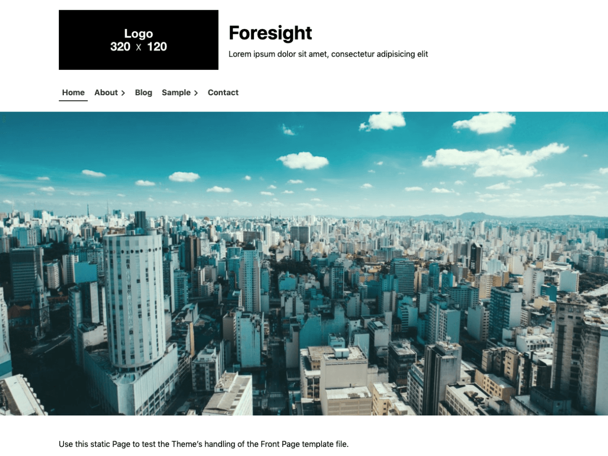

# Foresight WordPress Theme

Foresight is a business website WordPress theme for the Block Editor. It is also a one page WordPress theme that designed to take full advantage of the Block Editor.

This theme is well suited for business, landing page, branding or marketing. It provides a fast way to build website easily customizable for companies or freelancers. You can focus on content or webpage creation using the Block Editor.

## Features

* You can easily build a website with a customizer that select a layout and setting colors and fonts
* Full support the Block Editor so you can focus on creating content and web pages
* Mobile First, Responsive web design for any device - laptop, desktop, smartphone, iPad, etc
* Wide Width default page layout for the Block Editor
* Landing Page Template for landing page or one page
* Optimized for japanese fonts

## WordPress Theme Functions

* Enable the Block Editor
* Blog
* Select colors
	* Header text
	* Background
	* Header background
	* Footer background
	* Main color
	* Accent color
	* Sub color
* Custom logo
* Settings font family
	* Base
	* Site Title
	* Headings
* Settings fonts set
	* Web safe fonts
	* [Google Fonts](https://fonts.google.com/)
* Settings icon fonts
	* [Font Awesome Free](https://github.com/FortAwesome/Font-Awesome)
	* [Line Awesome](https://icons8.jp/line-awesome)
* Custom Header
* Custom Background image
* Select archive layout
	* Article, All image
	* Article Only
	* Article, Image
	* Image, Article
	* Card
	* Topics
* Enable sidebar layout (Two columns, Right sidebar layout)
* Settings archive excerpt
* Settings width ratio of footer widget column
	* 1:1
	* 2:1
	* 1:2
* Settings credit notation
* Custom menu
	* global menu
* Settings Widget
	* Page sidebar
	* Post sidebar
	* Footer
* Add template page
	* Top Page Template (page only)
	* Landing Page Template (page only)
	* Narrow Width Page Template (page only)
	* Sidebar Page Template (page and post)
	* Eyecatch Header Page Template (page only)

## Requirements

* [WordPress](https://wordpress.org/) 5.1+
* [PHP](https://www.php.net/) 7.0+

## Browser Support

### Desktop

* Chrome: Current and (Current - 1)
* Edge: Current and (Current - 1)
* Firefox: Current and (Current - 1)
* Safari: Current and (Current - 1)
* Opera: Current

### Mobile

* Stock browser on Android 4.0+
* Safari on iOS 7+

### Unsupported Browsers

* Internet Explorer

## Resources

Foresight bundles the following third-party resources:

* Based on [WP Theme Boilerplate](https://github.com/thingsym/wp-theme-boilerplate), [GPLv2 or later](https://www.gnu.org/licenses/gpl-2.0.html)
* CSS reset by [normalize.css](https://necolas.github.io/normalize.css/), [MIT](https://opensource.org/licenses/MIT)
* [Font Awesome Free](https://github.com/FortAwesome/Font-Awesome), [MIT](https://opensource.org/licenses/MIT), [SIL OFL 1.1](https://opensource.org/licenses/OFL-1.1), [CC BY 4.0](https://creativecommons.org/licenses/by/4.0/deed)
* [Line Awesome](https://icons8.jp/line-awesome), [MIT](https://opensource.org/licenses/MIT)
* Header image in screenshot.png by [rawpixel](https://pixabay.com/images/id-3139127/), [Pixabay License](https://pixabay.com/ja/service/license/)

## Contribution

### Patches and Bug Fixes

Small patches and bug reports can be submitted a issue tracker in GitHub. Forking on GitHub is another good way. You can send a pull request.

1. Fork [Foresight WordPress Theme](https://github.com/thingsym/foresight/) from GitHub repository
2. Create a feature branch: git checkout -b my-new-feature
3. Commit your changes: git commit -am 'Add some feature'
4. Push to the branch: git push origin my-new-feature
5. Create new Pull Request

## Changelog

### [1.0.0] - 2019.11.25

- initial release

## License

Foresight WordPress Theme, Copyright 2019 thingsym

Foresight is distributed under [the terms of GNU General Public License V2 or later](https://www.gnu.org/licenses/gpl-2.0.html).
